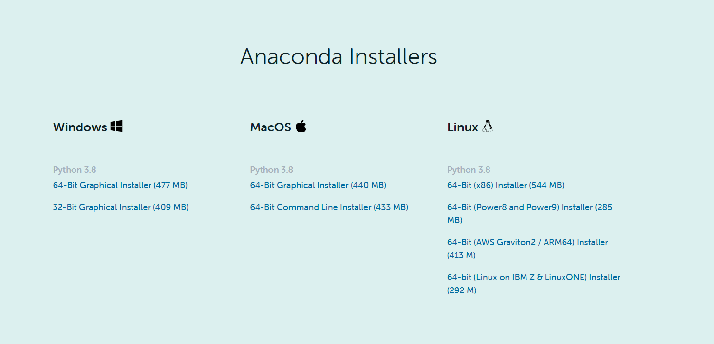
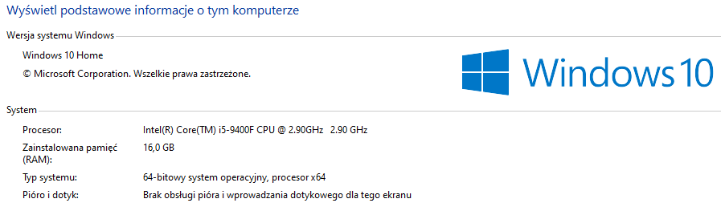

# Instalacja i uruchomienie projektu

**[1. Wstęp](#wstęp)**

**[2. Instalacja potrzebnych składników](#Instalacja-potrzebnych-składników)**

> [Anaconda](#architektura-sieci)
>
> [Wirtualne środowisko](#wirtualne-środowisko)
>
> [Procesor GPU](#procesor-GPU)
**[3. Wyniki](#wyniki)**

**[4. Analiza kodu](#analiza-kodu)**

**[5. Analiza modeli](#analiza-modeli)**

# 1. Wstęp

Celem projektu opisanego w niniejszym sprawozdaniu, realizowanego w ramach pracy dyplomowej na uczelni Politechniki Poznańskiej o temacie Detekcja obszarów i rodzaju szkód łowieckich na bazie zdjęć lotniczych przy wsparciu metod uczenia maszynowego jest udokumentowanie kroków, które zostały podjęte od instalacji programów do tworzenia maski i wykrywania szkód na obrazach. Zostanie zaprezentowana na windowsie 10 instrukcja instalacji programu anaconda oraz środowiska i bibliotek, które zostały użyte w projekcie.
Następnie pokażę jak wykorzystać procesor GPU, który znacząco przyspiesza naukę modeli oraz stworzyć swoje własne modele.

# 2. Instalacja potrzebnych składników

Należy zacząć od pobrania odpowiedniej wersji anacondy z ich strony:
[Anaconda link](https://www.anaconda.com/products/individual#Downloads)

W moim przypadku była to wersja na Windows 10 64-bit

Po pobraniu instalatora należy przejść przez standardowy proces instalacji.
Następnie należy uruchomić program anaconda navigator.
Na start dostajemy bazowe środowisko, w którym można utworzyć podstawowe projekty.
Żeby kod poprawnie działał należy stworzyć nowe środowisko oraz pobrać odpowiednie biblioteki. 
Aby przyspieszyć ten proces umieściłem kopie środowiska użytego w prowadzonym projekcie w danym repozytorium o nazwie Environment_DeepLearning_GPU.yml
lub pod tym linkiem:
[srodowisko_anaconda](..blob/main/Environment_DeepLearning_GPU.yml)
